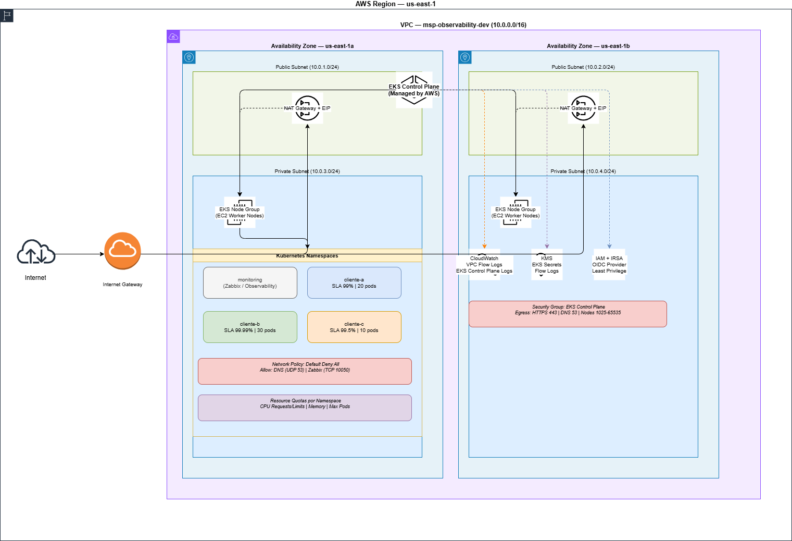

# MSP Multi-Tenant Observability Platform

Production-ready Zabbix monitoring solution for Managed Service Providers managing multiple AWS clients with different SLAs, auto-scaling requirements, and cost optimization needs.

---

## Why This Project Exists

### The Real-World Problem

Managed Service Providers (MSPs), face a unique operational challenge when managing cloud infrastructure for multiple clients simultaneously. Each client has:

- **Different SLA requirements** (99%, 99.9%, 99.99%)
- **Different budget constraints** (cost optimization is critical)
- **Different traffic patterns** (24/7 vs business hours only)
- **Different scaling needs** (conservative vs aggressive)

**The Challenge:** How do you provide proactive monitoring, automated scaling, and cost optimization for ALL clients at once, while maintaining SLA compliance and resource isolation?

### The Solution

This project demonstrates a **multi-tenant Zabbix monitoring platform** that addresses these challenges through:

- **Isolated monitoring** with client-specific dashboards and metrics
- **SLA-aware auto-scaling** with different thresholds per client
- **Cost optimization** through off-hours scaling for non-critical workloads
- **Self-healing automation** via webhook-driven Kubernetes scaling
- **Proactive alerting** with Slack integration

### Why This Matters for MSPs

Traditional monitoring solutions treat all clients equally. This platform demonstrates **SLA-aware observability** where:

- **Fintech client (99.99% SLA)** → Aggressive auto-scaling at 60% CPU for 2 minutes
- **E-commerce (99% SLA)** → Balanced scaling at 75% CPU for 5 minutes
- **SaaS B2B (99.5% SLA)** → Cost-optimized scaling with off-hours pod reduction

---

## Architecture Overview



### DevSecOps Pipeline


### Data Flow
```
1. Application generates metrics (CPU, memory, response time)
   ↓
2. Zabbix Agent (DaemonSet) collects metrics from pods
   ↓
3. Zabbix Server analyzes metrics against SLA-specific triggers
   ↓
4. Trigger activated (e.g., "Cliente B CPU > 60% for 2min")
   ↓
5. Zabbix fires Action → Webhook to monitoring service
   ↓
6. Webhook Handler receives trigger payload
   ↓
7. Auto-scaler executes: kubectl scale deployment --replicas=X
   ↓
8. Kubernetes scales pods (e.g., 5 → 20 pods for Cliente B)
   ↓
9. Load distributed, CPU normalizes
   ↓
10. Slack notification sent: "Cliente B auto-scaled 5→20 pods"
```

---

## Quick Start

### Prerequisites

- AWS Account with EKS permissions
- Terraform >= 1.0
- kubectl >= 1.28
- AWS CLI >= 2.0 configured
- Helm >= 3.0
- Docker >= 20.0

### Deploy Complete Platform
```bash
# 1. Clone repository
git clone https://github.com/DanielMelo1/msp-observability-platform.git
cd msp-observability-platform

# 2. Deploy infrastructure and applications
./scripts/setup.sh

# 3. Access Zabbix
kubectl port-forward -n monitoring svc/zabbix-frontend 8080:80
# Open: http://localhost:8080
# Login: Admin / zabbix
```

### Clean Up
```bash
# Delete all resources
cd terraform/environments/dev
kubectl delete pvc --all -n cliente-a
kubectl delete pvc --all -n cliente-b
kubectl delete pvc --all -n cliente-c
kubectl delete pvc --all -n monitoring
terraform destroy -auto-approve
```

---

## Simulated Clients

| Client | Type | SLA | Traffic Pattern | Auto-scaling | Threshold |
|--------|------|-----|----------------|--------------|-----------|
| **Cliente A** | E-commerce | 99% | 100 → 1500 req/s | 2 → 8 pods | 75% CPU / 5min |
| **Cliente B** | Fintech | 99.99% | 500 → 5000 req/s | 5 → 20 pods | 60% CPU / 2min |
| **Cliente C** | SaaS B2B | 99.5% | 200 → 10 req/s | 1 → 4 pods | 80% CPU / 10min |

### Key Differences

**Cliente A (E-commerce):**
- Moderate SLA (7.2h downtime/month allowed)
- Balanced auto-scaling approach
- No special cost optimization

**Cliente B (Fintech):**
- Critical SLA (4min downtime/month only)
- Aggressive auto-scaling (scales faster, more pods)
- Higher minimum replicas (5 vs 2)
- Shorter evaluation window (2min vs 5min)

**Cliente C (SaaS B2B):**
- Business hours focused (8am-8pm)
- Cost optimization enabled
- Scales down to 1 pod during off-hours (8pm-8am)
- Saves ~60% compute costs during nights/weekends

---

## Project Structure
```
msp-observability-platform/
├── docs/                        # Technical documentation
│   ├── DEPLOYMENT.md            # Complete deployment guide
│   └── screenshots/             # 15 deployment evidence images
├── terraform/                   # Infrastructure as Code
│   ├── modules/                 # Reusable Terraform modules
│   │   ├── networking/          # VPC, subnets, NAT
│   │   ├── eks/                 # EKS cluster
│   │   └── namespaces/          # K8s namespaces
│   └── environments/dev/        # Environment-specific config
├── k8s/                         # Kubernetes manifests
│   ├── zabbix/                  # Zabbix monitoring stack
│   ├── cliente-a/               # E-commerce namespace
│   ├── cliente-b/               # Fintech namespace
│   ├── cliente-c/               # SaaS namespace
│   └── monitoring/              # Webhook handler
├── app/                         # Application code
│   ├── common/                  # Shared configuration
│   ├── base-api/                # FastAPI template
│   └── load-generator/          # Locust load testing
├── zabbix-config/               # Zabbix configuration
│   ├── templates/               # SLA-specific templates
│   ├── dashboards/              # Monitoring dashboards
│   ├── automation/              # Auto-scaling webhooks
│   └── scripts/                 # Setup automation
└── scripts/                     # Deployment automation
    └── setup.sh                 # Complete deployment script
```

---

## Key Features Demonstrated

### 1. Multi-Tenant Isolation
- Each client runs in dedicated Kubernetes namespace
- Separate resource quotas and limits (LimitRange, ResourceQuota)
- Network policies for inter-namespace communication
- Isolated monitoring templates and dashboards

### 2. SLA-Aware Monitoring
- Different Zabbix triggers per SLA level
- Critical clients (99.99%) get more aggressive thresholds
- Non-critical clients (99%) have relaxed thresholds
- Custom dashboards per client

### 3. Automated Scaling
- Webhook-driven auto-scaling based on Zabbix triggers
- HPA (Horizontal Pod Autoscaler) with Metrics Server
- No manual intervention required
- Scales both up and down based on load

### 4. Cost Optimization
- Cliente C automatically scales down during off-hours
- Saves ~60% compute costs for non-critical workloads
- Scheduling logic configurable per client

### 5. Production-Ready Infrastructure
- AWS EKS with managed control plane
- Multi-AZ deployment for high availability
- EBS CSI Driver with IRSA for persistent storage
- AWS Load Balancer Controller for Ingress

---

## Technology Stack

**Infrastructure:**
- AWS EKS (Kubernetes 1.31)
- Terraform (Infrastructure as Code)
- VPC with public/private subnets across 3 AZs
- NAT Gateways for private subnet internet access

**Monitoring:**
- Zabbix 7.0 (Server + Frontend)
- PostgreSQL 15 (Zabbix database with subPath configuration)
- Zabbix Agents (DaemonSet on all nodes)

**Applications:**
- Python 3.12 + FastAPI
- Gunicorn (production WSGI)
- PostgreSQL (application databases)

**Kubernetes Addons:**
- AWS Load Balancer Controller
- EBS CSI Driver (with IRSA)
- Metrics Server (for HPA)

**Automation:**
- Python webhook handlers
- kubectl (Kubernetes API)
- Slack webhooks (optional alerting)

**Container Registry:**
- GitHub Container Registry (GHCR)
- Public images - no authentication needed

---

## Docker Images

### Pre-built Images (GitHub Container Registry)

This project uses pre-built Docker images hosted on GitHub Container Registry (GHCR):

- `ghcr.io/danielmelo1/base-api:latest` - Multi-tenant FastAPI application
- `ghcr.io/danielmelo1/webhook-handler:latest` - Zabbix webhook handler

These images are **publicly available** - you don't need Docker Hub or any registry account to deploy this project.

### Building Your Own Images

If you want to customize and build your own images:
```bash
# 1. Build images locally
docker build -t base-api:latest -f app/base-api/Dockerfile app/
docker build -t webhook-handler:latest -f zabbix-config/automation/Dockerfile zabbix-config/automation/

# 2. Tag for your registry (GitHub Container Registry example)
docker tag base-api:latest ghcr.io/YOUR_USERNAME/base-api:latest
docker tag webhook-handler:latest ghcr.io/YOUR_USERNAME/webhook-handler:latest

# 3. Login to GHCR
docker login ghcr.io
# Username: YOUR_GITHUB_USERNAME
# Password: YOUR_GITHUB_TOKEN (with write:packages scope)

# 4. Push images
docker push ghcr.io/YOUR_USERNAME/base-api:latest
docker push ghcr.io/YOUR_USERNAME/webhook-handler:latest

# 5. Update Kubernetes manifests
# Edit k8s/cliente-a/app-deployment.yaml
# Edit k8s/cliente-b/app-deployment.yaml
# Edit k8s/cliente-c/app-deployment.yaml
# Edit k8s/monitoring/webhook-handler.yaml
# Replace: ghcr.io/danielmelo1 with ghcr.io/YOUR_USERNAME
```

### Making Images Public on GHCR

After pushing images to GHCR:

1. Go to https://github.com/YOUR_USERNAME?tab=packages
2. Click on the package (base-api or webhook-handler)
3. Go to "Package settings"
4. Scroll to "Danger Zone"
5. Click "Change visibility" → Select "Public"
6. Confirm by typing the package name

This allows others to use your images without authentication.

---

## Documentation

Comprehensive documentation is available in the `docs/` directory:

- **[DEPLOYMENT.md](docs/DEPLOYMENT.md)** - Complete deployment guide with:
  - Prerequisites and AWS account setup
  - Step-by-step deployment instructions
  - EBS CSI Driver IRSA configuration
  - PostgreSQL subPath configuration details
  - Troubleshooting guide for common issues
  - Clean destruction process

- **[screenshots/](docs/screenshots/)** - 15 deployment evidence images:
  - AWS infrastructure (EKS cluster, EC2 nodes)
  - Kubernetes resources (nodes, pods, HPA)
  - Zabbix monitoring (dashboard, hosts, templates, items, problems)
  - Auto-scaling demonstration (before/after load test)

---

## Frequently Asked Questions

### Why 3 clients? Isn't that over-engineering?

No. This simulates a real MSP scenario where you manage multiple clients with different requirements. A single-client demo wouldn't demonstrate:
- **Multi-tenant isolation** (namespaces, resource quotas)
- **SLA-specific thresholds** (different triggers per client criticality)
- **Differential auto-scaling policies** (aggressive vs conservative)
- **Selective cost optimization** (off-hours scaling for specific clients)

The structure is modular - adding a 4th client takes ~10 minutes.

### Why not use Prometheus + Grafana instead of Zabbix?

This project specifically demonstrates Zabbix expertise. The architecture patterns (multi-tenancy, SLA-aware monitoring, webhook automation) would work equally well with Prometheus/Grafana, but Zabbix provides:
- Built-in alerting and webhook actions (no Alertmanager needed)
- Mature auto-discovery for large infrastructures
- Traditional MSP monitoring workflows

### Is this production-ready?

The code quality and architecture are production-ready. For actual production deployment, you should add:
- **Secrets management** (AWS Secrets Manager or HashiCorp Vault)
- **TLS/SSL certificates** (AWS ACM + cert-manager)
- **Backup/restore automation** (Velero for Kubernetes, AWS Backup for databases)
- **Network policies enforcement** (Calico or Cilium)
- **Comprehensive logging** (Fluent Bit + CloudWatch or ELK stack)
- **GitOps workflow** (ArgoCD or Flux)

The current setup is ideal for:
- Technical demonstrations
- Proof of concepts
- Development/staging environments
- Learning and experimentation

### How much does this cost to run?

Estimated monthly costs (us-east-1):
- **EKS Cluster:** ~$73/month
- **3× t3.medium nodes:** ~$90/month
- **NAT Gateways (3):** ~$32/month
- **Application Load Balancer:** ~$16/month
- **EBS Volumes (4× 20GB):** ~$8/month

**Total: ~$219/month** (~$7/day)

**Cost optimization tips:**
- Use `terraform destroy` after testing to avoid charges
- Consider smaller instance types (t3.small) for non-production
- Reduce NAT Gateways to 1 for dev environments
- Use Spot Instances for non-critical workloads

### Can I use this for my own MSP business?

Yes! This project is MIT licensed. You can:
- Use it as-is for your MSP operations
- Customize for your specific clients
- Extend with additional monitoring tools
- Integrate with your existing workflows

Just remember to:
- Replace placeholder credentials with proper secrets management
- Implement production-grade security (TLS, network policies)
- Add compliance requirements specific to your industry
- Test thoroughly before production use

---

## Contributing

This is a demonstration project for showcasing technical skills. However, improvements are welcome:

1. Fork the repository
2. Create a feature branch (`git checkout -b feature/amazing-feature`)
3. Make your changes with clear commit messages
4. Test your changes thoroughly
5. Submit a pull request

---

## License

MIT License - see [LICENSE](LICENSE) file for details.

---

## Author

**Daniel Melo**  
DevOps/SRE Engineer

- GitHub: [@DanielMelo1](https://github.com/DanielMelo1)
- Project: [msp-observability-platform](https://github.com/DanielMelo1/msp-observability-platform)

Created as a technical demonstration project showcasing:
- Multi-tenant Zabbix monitoring architecture
- AWS EKS infrastructure management with Terraform
- Kubernetes automation and auto-scaling
- SLA-aware observability patterns
- Cost optimization strategies for MSPs

---

## Acknowledgments

This project demonstrates real-world MSP challenges and solutions, inspired by the operational needs of Managed Service Providers managing multiple client infrastructures on AWS with varying SLA requirements and cost constraints.

The architecture patterns and best practices shown here are applicable to production MSP environments and can be adapted for various cloud providers and monitoring solutions.
