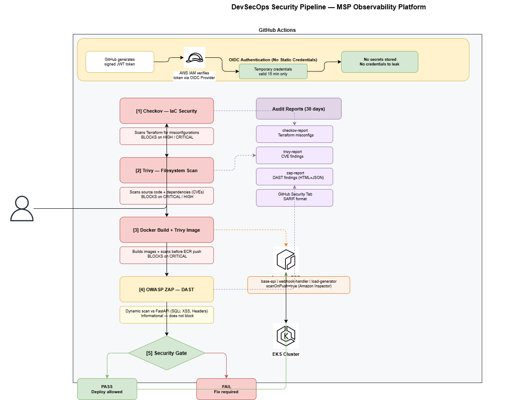

# Security Architecture — MSP Observability Platform

## Overview

This document describes the DevSecOps security layer implemented in the MSP Observability Platform. The security architecture follows a **shift-left** approach — catching vulnerabilities as early as possible in the development cycle, before they reach production.

The principle is simple: **the earlier a security issue is found, the cheaper it is to fix.**

---

## Security Pipeline



Every pull request and push to main triggers the full security pipeline:
```
Developer pushes code
        ↓
┌─────────────────────┐
│  [1] Checkov        │ ← Scans Terraform for misconfigurations
│      IaC Security   │   BLOCKS pipeline on CRITICAL findings
└────────┬────────────┘
         ↓
┌─────────────────────┐
│  [2] Trivy          │ ← Scans code and dependencies for CVEs
│      CVE Scanner    │   BLOCKS pipeline on CRITICAL/HIGH
└────────┬────────────┘
         ↓
┌─────────────────────┐
│  [3] Docker Build   │ ← Builds all images locally
│      + Trivy Scan   │   Scans each image before ECR push
└────────┬────────────┘
         ↓
┌─────────────────────┐
│  [4] OWASP ZAP      │ ← Dynamic scan against live FastAPI
│      DAST           │   Informational — does not block
└────────┬────────────┘
         ↓
┌─────────────────────┐
│  [5] Security Gate  │ ← Final decision point
│      Pass or Fail   │   ✅ Deploy allowed / ❌ Fix required
└─────────────────────┘
```

---

## Tools

### Checkov — IaC Security Scanner

Checkov analyzes all Terraform files before any infrastructure change is applied. It detects security misconfigurations such as:

- S3 buckets without encryption or public access blocks
- Security groups with unrestricted ingress (0.0.0.0/0)
- IAM roles with excessive permissions
- EKS clusters without audit logging enabled
- RDS instances without encryption at rest

**Pipeline behavior:** Blocks on any HIGH or CRITICAL finding. The Terraform plan never runs if Checkov fails.

Run locally:
```bash
pip install checkov
checkov -d terraform/ --framework terraform
```

---

### Trivy — Vulnerability Scanner

Trivy performs two types of scans:

**Filesystem scan** — analyzes source code and dependency files (requirements.txt, package.json) for known CVEs in the National Vulnerability Database.

**Image scan** — analyzes each Docker image after build, before pushing to ECR. A vulnerable image never reaches the registry.

**Pipeline behavior:** Blocks on CRITICAL severity. HIGH severity generates a report but does not block.

Run locally:
```bash
# Scan filesystem
trivy fs .

# Scan a specific image
trivy image base-api:latest

# Scan only CRITICAL
trivy fs . --severity CRITICAL
```

---

### OWASP ZAP — Dynamic Application Security Testing

OWASP ZAP simulates an attacker interacting with the running FastAPI application. It tests for:

- SQL Injection
- Cross-Site Scripting (XSS)
- Missing security headers
- Authentication bypass attempts
- Sensitive data exposure in responses

**Pipeline behavior:** Informational at this stage — does not block the pipeline. Reports are saved as artifacts for review after each run.

---

## OIDC Authentication

### The Problem with Static Credentials

Traditional CI/CD pipelines store AWS credentials as GitHub Secrets:
```
AWS_ACCESS_KEY_ID=AKIA...
AWS_SECRET_ACCESS_KEY=...
```

These keys never expire. If leaked, they provide permanent AWS access until manually revoked. This is a critical security risk.

### The OIDC Solution

This project uses OpenID Connect (OIDC) to eliminate static credentials entirely.

**How it works:**
```
GitHub Actions job starts
        ↓
GitHub generates a signed JWT token
(proves: repo=DanielMelo1/msp-observability-platform, branch=main)
        ↓
AWS IAM verifies the token with GitHub
        ↓
AWS issues temporary credentials (valid 15 minutes only)
        ↓
Job completes — credentials expire automatically
```

No credentials stored anywhere. No credentials to leak.

### OIDC Configuration in AWS

To configure OIDC in your AWS account:

**Step 1 — Create the OIDC Provider:**
```bash
aws iam create-open-id-connect-provider \
  --url https://token.actions.githubusercontent.com \
  --client-id-list sts.amazonaws.com \
  --thumbprint-list 6938fd4d98bab03faadb97b34396831e3780aea1
```

**Step 2 — Create the IAM Role:**
```bash
aws iam create-role \
  --role-name github-actions-deploy-role \
  --assume-role-policy-document file://docs/oidc-trust-policy.json
```

**Step 3 — Trust Policy (docs/oidc-trust-policy.json):**
```json
{
  "Version": "2012-10-17",
  "Statement": [
    {
      "Effect": "Allow",
      "Principal": {
        "Federated": "arn:aws:iam::509399596610:oidc-provider/token.actions.githubusercontent.com"
      },
      "Action": "sts:AssumeRoleWithWebIdentity",
      "Condition": {
        "StringEquals": {
          "token.actions.githubusercontent.com:aud": "sts.amazonaws.com",
          "token.actions.githubusercontent.com:sub": "repo:DanielMelo1/msp-observability-platform:ref:refs/heads/main"
        }
      }
    }
  ]
}
```

---

## ECR Setup

Amazon ECR repositories must exist before the pipeline can push images.

Create the repositories:
```bash
aws ecr create-repository \
  --repository-name msp-observability/base-api \
  --region us-east-1 \
  --image-scanning-configuration scanOnPush=true

aws ecr create-repository \
  --repository-name msp-observability/webhook-handler \
  --region us-east-1 \
  --image-scanning-configuration scanOnPush=true

aws ecr create-repository \
  --repository-name msp-observability/load-generator \
  --region us-east-1 \
  --image-scanning-configuration scanOnPush=true
```

Note: `scanOnPush=true` enables automatic vulnerability scanning by Amazon Inspector every time an image is pushed.

---

## Security Gate

The Security Gate is the final job in the validation pipeline. It collects results from all security scans and makes a single pass/fail decision.

| Scan | Severity | Pipeline behavior |
|------|----------|-------------------|
| Checkov | Any finding | Blocks |
| Trivy (filesystem) | CRITICAL, HIGH | Blocks |
| Trivy (image) | CRITICAL | Blocks |
| OWASP ZAP | Any | Informational |

---

## Audit Reports

All security scan reports are saved as GitHub Actions artifacts with 30-day retention:

| Artifact | Content | Retention |
|----------|---------|-----------|
| `checkov-report` | Terraform misconfigurations | 30 days |
| `trivy-report` | CVE findings + config issues | 30 days |
| `zap-report` | DAST findings (HTML + JSON) | 30 days |

Results are also uploaded to the GitHub Security tab (SARIF format) for centralized visibility.

---

## Security Recommendations for Production

The following improvements are recommended before using this platform in a production MSP environment:

- **Secrets Manager** — migrate all application secrets to AWS Secrets Manager
- **TLS everywhere** — enable TLS on all endpoints via AWS ACM and cert-manager
- **Network Policies** — enforce Kubernetes NetworkPolicy for all namespaces
- **Pod Security Standards** — apply restricted PSS profile to all workloads
- **Audit Logging** — enable EKS control plane audit logs to CloudWatch
- **Root account** — replace root AWS credentials with dedicated IAM user with least-privilege

---

## Author

Daniel Melo — Cloud Engineer | DevOps | SRE

- GitHub: [@DanielMelo1](https://github.com/DanielMelo1)
- LinkedIn: [danielaugustormelo](https://linkedin.com/in/danielaugustormelo)
